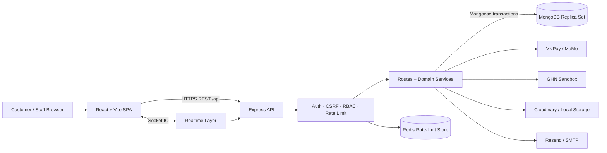

# BookShop — MERN Online Bookstore

BookShop là một ứng dụng thương mại điện tử bán sách được xây dựng với MERN Stack, bao gồm storefront cho khách hàng và hệ thống quản trị theo quyền hạn cho nhân viên. Project giải quyết trọn vẹn hành trình mua sách trực tuyến: khám phá sản phẩm, giỏ hàng, checkout, thanh toán, giao vận, đổi trả, chăm sóc khách hàng và vận hành kho. Đối tượng sử dụng gồm khách mua sách, quản trị viên, nhân viên kho, chăm sóc khách hàng, nội dung và kế toán.

> Đây là một portfolio project thiên về backend/full-stack. README này được tổng hợp trực tiếp từ source code, route, model, service, test, `package.json`, `.env.example`, Docker và cấu hình Render hiện có trong repository.

## Table of Contents

- [Features](#-features)
- [Tech Stack](#-tech-stack)
- [Architecture / System Overview](#-architecture--system-overview)
- [Project Structure](#-project-structure)
- [Main Modules](#-main-modules)
- [Database Models](#-database-models)
- [Main Business Flows](#-main-business-flows)
- [API Overview](#-api-overview)
- [Environment Variables](#-environment-variables)
- [Installation & Running Locally](#-installation--running-locally)
- [Roles & Permissions](#-roles--permissions)
- [Testing](#-testing)
- [Deployment](#-deployment)

## ✨ Features

### Customer Features

- Đăng ký, đăng nhập, đăng xuất và tự làm mới phiên đăng nhập bằng access/refresh JWT.
- Xác minh email, quên mật khẩu, đặt lại mật khẩu, đổi mật khẩu và cập nhật hồ sơ.
- Quản lý tối đa 10 địa chỉ giao hàng, địa chỉ mặc định và danh sách yêu thích.
- Duyệt sách mới, sách bán chạy và các nhóm sách trên trang chủ.
- Tìm kiếm full-text; lọc theo danh mục, tác giả, tag, khoảng giá, rating; sắp xếp và phân trang.
- Xem chi tiết sách, metadata xuất bản, tồn kho, gallery, đánh giá và giá khuyến mãi đang hiệu lực.
- Gợi ý sách cá nhân hóa từ lượt xem, thao tác giỏ hàng, lịch sử mua, wishlist và độ mới của tín hiệu; fallback về sách phổ biến khi chưa đủ dữ liệu.
- Giỏ hàng cho khách vãng lai lưu trên `localStorage`; tự merge vào giỏ hàng MongoDB sau khi đăng nhập.
- Mua ngay hoặc checkout từ giỏ hàng; server kiểm tra lại giá, khuyến mãi, tồn kho, voucher, điểm thưởng và cước vận chuyển.
- Nhận báo giá vận chuyển từ GHN Sandbox theo địa chỉ và thông tin kiện hàng.
- Thanh toán COD, VNPay, MoMo; có mock gateway cho môi trường development.
- Theo dõi đơn hàng, timeline, thanh toán, vận chuyển; thử thanh toán lại và hủy đơn khi trạng thái cho phép.
- Gửi yêu cầu đổi/trả theo từng sản phẩm, đính kèm ảnh và theo dõi xử lý/hoàn tiền.
- Đánh giá sách đã mua trong đơn đã giao, đính kèm ảnh, sửa/xóa đánh giá và báo cáo nội dung không phù hợp.
- Tích/tiêu điểm, theo dõi lịch sử điểm và hạng thành viên, đổi quà thành voucher cá nhân.
- Nhận thông báo trong ứng dụng theo thời gian thực và tùy chỉnh thông báo email/in-app theo từng loại sự kiện.
- Chat realtime với bộ phận hỗ trợ, có auto-reply cơ bản và chuyển tiếp cho nhân viên.
- Tạo ticket hỗ trợ gắn với đơn hàng, nhắn tin, gửi bằng chứng và theo dõi SLA/trạng thái xử lý.
- Đọc tin/bài viết; đăng ký newsletter theo luồng xác nhận email và hủy đăng ký bằng token.

### Admin Features

- Dashboard với thống kê đơn hàng, người dùng, doanh thu, biểu đồ, top sách, hoạt động và funnel analytics.
- CRUD sách và danh mục; quản lý metadata như ISBN, tác giả, nhà xuất bản, edition, ảnh, thuộc tính, kích thước và thông tin tồn kho.
- Quản lý đơn hàng theo state machine; xác nhận COD, hủy, tạo/hủy vận đơn, mô phỏng giao hàng, đánh dấu giao thành công và xem payment audit.
- Xử lý yêu cầu đổi/trả, hoàn tiền qua gateway hoặc đánh dấu cần hoàn thủ công.
- Xuất đơn hàng và báo cáo lợi nhuận dạng CSV.
- Quản lý nhà cung cấp, phiếu nhập, phiếu xuất, kiểm kho, stock ledger, hàng sắp hết, định giá tồn và đối soát tồn kho.
- Quản lý voucher theo đơn/phí vận chuyển và promotion theo sản phẩm/danh mục.
- Cấu hình chương trình loyalty, tier, tỷ lệ tích/đổi điểm, thành viên, điều chỉnh điểm và danh mục quà.
- Quản lý bài viết, danh mục bài viết, trạng thái publish/unpublish và newsletter.
- Kiểm duyệt đánh giá và xử lý report.
- Quản lý user, khóa/mở tài khoản, gán role; tạo role tùy chỉnh từ permission catalog.
- Vận hành live chat, hàng đợi support ticket, assignee, SLA và phương án bồi hoàn/gửi lại hàng.
- Upload ảnh có kiểm tra định dạng/kích thước, chuyển sang WebP và theo dõi vòng đời asset.
- Xem audit log quản trị, metadata log và export dữ liệu.
- Các maintenance job cho đơn hết hạn, hủy/hoàn tiền, mô phỏng giao hàng, cảnh báo khuyến mãi, dọn asset, nhắc giỏ hàng, SLA ticket và đối soát tồn.

## 🛠 Tech Stack

| Layer | Công nghệ |
| --- | --- |
| Frontend | React 18, Vite 6, React Router 7, Tailwind CSS 3 |
| UI & Forms | Radix UI primitives, Lucide React, React Hook Form, Zod, Sonner |
| Client Data | TanStack Query, Context API, Fetch API |
| Tables & Charts | TanStack Table, TanStack Virtual, Recharts |
| Backend | Node.js, Express 4, CommonJS |
| Database | MongoDB 7, Mongoose 9, MongoDB transactions/replica set |
| Authentication | JWT access/refresh token, server-side `AuthSession`, HttpOnly cookies, CSRF double-submit protection |
| Authorization | Database-backed RBAC, permission catalog, route-level permission guards |
| Security | bcryptjs, Helmet/CSP, CORS allowlist, express-rate-limit, Redis-backed shared rate limits, request/error sanitization |
| Realtime | Socket.IO / Socket.IO Client |
| Payment | COD, VNPay, MoMo, development mock gateway; signed callbacks/webhooks and refund reconciliation |
| Shipping | GHN Sandbox quotes, shipment creation/cancel, verified webhook and simulation |
| Storage | Cloudinary in production; local upload fallback in development; Multer + Sharp/WebP processing |
| Email | Resend HTTP API hoặc SMTP qua Nodemailer |
| Testing | Node Test Runner, Supertest, mongodb-memory-server, Vitest, Testing Library, jsdom |
| Operations | Docker Compose, Render Blueprint, scheduled maintenance job, health/readiness endpoints |

## 🏗 Architecture / System Overview

Frontend React gọi REST API dưới prefix `/api` và kết nối Socket.IO tới cùng backend. Express xác thực phiên, CSRF và permission trước khi chuyển request tới route/service; service thực thi nghiệp vụ trong MongoDB transaction khi cần. MongoDB là nguồn dữ liệu chính, Redis chia sẻ state rate-limit ở production, còn payment, email, Cloudinary và GHN là các tích hợp ngoài.



Trong production, Express phục vụ luôn static build tại `frontend/dist`. Business logic hiện được tổ chức chủ yếu trong `backend/src/services/` và một phần route handler; project không có thư mục `controllers/` riêng.

## 📁 Project Structure

```text
BookShop/
├── backend/
│   ├── src/
│   │   ├── config/          # DB, runtime config, role/permission catalog
│   │   ├── jobs/            # Maintenance, reconcile, backfill và simulation jobs
│   │   ├── middleware/      # Auth/RBAC, CSRF và error handling
│   │   ├── models/          # Mongoose schemas và state models
│   │   ├── routes/          # REST endpoints, validation và route guards
│   │   ├── serializers/     # Public/customer-safe response mapping
│   │   ├── services/        # Nghiệp vụ order, payment, inventory, loyalty, support...
│   │   ├── utils/           # Transaction, security, validation helpers
│   │   ├── validators/      # Book/post input validation
│   │   ├── index.js         # Express + HTTP + Socket.IO bootstrap
│   │   └── seed.js          # Seed dữ liệu demo có destructive guard
│   ├── test/                # Backend unit/integration tests
│   ├── .env.example
│   └── package.json
├── frontend/
│   ├── public/
│   ├── scripts/             # Bundle budget và SEO file generation
│   ├── src/
│   │   ├── app/             # Shared providers
│   │   ├── components/      # Storefront, admin, checkout, order, UI components
│   │   ├── context/         # Auth, cart và category state
│   │   ├── features/        # Feature hooks/schema/constants
│   │   ├── hooks/           # Wishlist, recently viewed, metadata, support events...
│   │   ├── layouts/         # Main, profile và admin layouts
│   │   ├── lib/             # Query client, RBAC và UI utilities
│   │   ├── pages/           # Customer/profile/admin route pages
│   │   ├── services/        # API client, Socket.IO và administrative data
│   │   ├── utils/           # Address, buy-now, loyalty, navigation, formatting
│   │   ├── App.jsx          # Frontend route tree + permission gates
│   │   └── main.jsx         # React application bootstrap
│   ├── .env.example
│   └── package.json
├── .github/                 # Repository automation/configuration
├── docker-compose.yml       # MongoDB 7 replica set for local development
├── render.yaml              # Render web service + maintenance cron Blueprint
└── README.md
```

> Dependency và script của ứng dụng nằm trong `backend/package.json` và `frontend/package.json`. Root `package.json` không phải monorepo runner của BookShop, vì vậy các lệnh local bên dưới luôn chạy trong đúng thư mục con hoặc dùng `--prefix`.

## 📦 Main Modules

| Module | Trách nhiệm chính |
| --- | --- |
| Authentication & Account | Đăng ký/đăng nhập, refresh rotation, session revoke, CSRF, xác minh email, reset password, profile, address, wishlist |
| Catalog & Discovery | CRUD sách/danh mục, metadata, full-text search, facets, filter/sort, home collections và personalized recommendations |
| Cart & Checkout | Guest cart, cart merge, stock normalization, buy-now, server-authoritative pricing, shipping quote, voucher và points preview |
| Orders | Idempotent order creation, order state machine, inventory reservation/commit/release, cancellation, status timeline và outbox events |
| Payments | COD, VNPay, MoMo, mock gateway, signed return/IPN/webhook, retry, duplicate payment handling và refund reconciliation |
| Shipping | GHN Sandbox master data, quote, shipment lifecycle, simulation và webhook verification |
| Reviews | Verified-purchase review, rating aggregate, image evidence, report và admin moderation |
| Returns & Support | Return eligibility, partial quantities, refund/reship resolution, support ticket, messages, SLA và evidence |
| Inventory | Supplier, receipt, issue, stock count, ledger, moving-average cost, low-stock alert, valuation và reconciliation |
| Promotions & Vouchers | Product/category promotion; order/shipping voucher; usage reservation và per-user limits |
| Loyalty | Earn/redeem, ledger, debt handling after refunds, tiers, member recalculation và gift-to-voucher redemption |
| Content & Newsletter | Posts, post categories, view counting, publish workflow, double opt-in newsletter và admin send |
| Notifications & Chat | In-app/email preference, Socket.IO notifications, customer/staff chat và automated reply |
| Admin & Governance | Dashboard, analytics funnel, profit/order reports, custom RBAC, user administration và audit trail |
| Media Lifecycle | Upload validation, Sharp normalization, Cloudinary/local storage, managed assets và cleanup |

## 🗄 Database Models

Các model chính và quan hệ đáng chú ý:

| Nhóm | Models | Mục đích / quan hệ |
| --- | --- | --- |
| Identity & Access | `User`, `AuthSession`, `Role`, `AuditLog` | User chứa profile, address, wishlist, role và loyalty snapshot; session giữ refresh-token hash; Role lưu permission; audit log theo dõi thao tác quản trị |
| Catalog | `Book`, `Category`, `Author`, `Publisher` | Book tham chiếu author/publisher/default supplier/edition group; giữ giá, sellable stock, reserved stock, metadata và rating aggregate |
| Cart & Order | `Cart`, `Order`, `OrderOutboxEvent`, `ReturnRequest` | Cart thuộc một User và tham chiếu Book; Order snapshot item/giá/chi phí/voucher/payment/shipping; ReturnRequest thuộc Order + User và chứa các item đổi trả |
| Review | `Review`, `ReviewReport` | Review liên kết Book + User; report liên kết Review + người báo cáo |
| Pricing | `Voucher`, `VoucherRedemption`, `Promotion` | Voucher có usage/per-user limit; redemption ghi nhận user sử dụng; Promotion áp dụng theo Book hoặc category |
| Inventory | `Supplier`, `StockLedger`, `StockReceipt`, `StockIssue`, `StockCount`, `Counter` | Chứng từ kho tham chiếu Book/Supplier/User; ledger là lịch sử biến động; Counter tạo mã chứng từ tuần tự |
| Loyalty | `LoyaltyProgram`, `LoyaltyLedger`, `LoyaltyGift`, `LoyaltyGiftRedemption`, `LoyaltyDebtEvent` | Program cấu hình rate/tier; ledger là nguồn sự thật cho điểm; gift redemption tạo voucher; debt event theo dõi điểm cần thu hồi sau refund |
| Support & Realtime | `Conversation`, `Message`, `SupportTicket`, `SupportTicketMessage`, `Notification` | Conversation thuộc User; message thuộc conversation; ticket liên kết User, Order, ReturnRequest và assignee; notification phát tới user/role |
| Content | `Post`, `PostCategory`, `NewsletterSubscription` | Post tham chiếu category và author; subscription quản lý confirm/unsubscribe token state |
| Operations | `AnalyticsEvent`, `UploadedAsset`, `PromotionAlertDelivery`, `CartReminderDelivery` | Theo dõi funnel, vòng đời upload và chống gửi trùng các alert/reminder |

MongoDB phải hỗ trợ transaction. Backend kiểm tra replica set hoặc sharded cluster khi khởi động và sẽ fail-fast nếu kết nối tới standalone MongoDB.

## 🔄 Main Business Flows

### 1. Register / Login

1. Client gọi `POST /api/auth/register` hoặc `POST /api/auth/login`.
2. Backend validate input, hash password bằng bcrypt và áp dụng rate limit theo IP/tài khoản.
3. Backend tạo `AuthSession`, access JWT, refresh JWT và CSRF token.
4. Access/refresh token được lưu trong HttpOnly cookie; request thay đổi dữ liệu phải gửi `X-CSRF-Token` khớp cookie/session.
5. Khi access token hết hạn, frontend gọi `/api/auth/csrf` rồi `/api/auth/refresh`; refresh token được rotate.
6. Email verification và password recovery dùng token hash có hạn, gửi qua Resend hoặc SMTP.

### 2. Browse / Search / Recommend Books

1. Trang sản phẩm gọi `GET /api/books` cùng query filter/sort/page hoặc các endpoint home collections.
2. Backend xây dựng MongoDB filter, tính facets và decorate giá theo promotion đang chạy.
3. Lượt xem/add-to-cart được ghi qua analytics event.
4. `GET /api/books/recommendations` chấm điểm từ view, cart, order, wishlist và recency; sách đã mua/đã trả được xử lý trong tín hiệu đề xuất.

### 3. Cart

1. Khách chưa đăng nhập thao tác trên guest cart trong `localStorage`.
2. Khi đăng nhập, frontend gọi `POST /api/cart/merge` để hợp nhất guest cart với cart của User.
3. Backend loại/đánh dấu sách không còn khả dụng, giới hạn quantity theo tồn thực tế và trả về giá promotion hiện tại.
4. Cart server hỗ trợ thêm, cập nhật, xóa item và xóa toàn bộ giỏ.

### 4. Checkout / Create Order / Payment

1. User chọn địa chỉ, phương thức vận chuyển và gọi `POST /api/shipping/quotes`.
2. Client có thể validate voucher, preview điểm và chọn checkout từ cart hoặc buy-now.
3. `POST /api/orders` bắt buộc đăng nhập, shipping option hợp lệ và hỗ trợ `Idempotency-Key`.
4. Trong transaction, backend tải lại Book, giá/promotion, voucher, loyalty và cước vận chuyển; kiểm tra expected total; giữ tồn kho và tạo Order.
5. COD tạo đơn chờ xác nhận. VNPay/MoMo tạo payment attempt và trả về payment URL; development có mock URL.
6. Return URL, IPN hoặc webhook đã xác minh cập nhật payment/order state và commit/release stock theo state machine.

### 5. Fulfillment / Cancellation / Return

1. Nhân viên có permission xác nhận COD/đơn đã thanh toán, tạo vận đơn GHN Sandbox và chuyển `PROCESSING → SHIPPED → DELIVERED`.
2. Hủy đơn sẽ giải phóng hoặc hoàn kho; đơn online đã thu tiền đi qua workflow refund.
3. Với đơn đã giao, khách có thể tạo return request: 7 ngày cho đổi ý, hoặc 30 ngày cho lỗi thuộc cửa hàng theo policy trong service.
4. Staff duyệt/từ chối, theo dõi hàng trả, hoàn tiền hoặc gửi lại hàng; loyalty và inventory được điều chỉnh tương ứng.

### 6. Review / Support / Notifications

1. Chỉ User đã mua Book trong Order `DELIVERED` mới được tạo review.
2. Customer chat, ticket message, order/payment/shipping/refund và loyalty event có thể phát thông báo qua Socket.IO.
3. Notification preference quyết định in-app/email; email chỉ bật khi tài khoản đã xác minh.
4. Support ticket có SLA, assignee, message/evidence và resolution gắn với order/return workflow.

## 🔌 API Overview

Base URL khi chạy local: `http://localhost:5000/api`.

### Health, Authentication & Profile

```http
GET    /api/health/live
GET    /api/health/ready
POST   /api/auth/register
POST   /api/auth/login
GET    /api/auth/csrf
POST   /api/auth/refresh
POST   /api/auth/logout
GET    /api/auth/me
PUT    /api/auth/me
PATCH  /api/auth/me/password
POST   /api/auth/forgot-password
POST   /api/auth/reset-password
POST   /api/auth/email-verification/request
POST   /api/auth/email-verification/verify
GET    /api/auth/me/addresses
POST   /api/auth/me/addresses
PUT    /api/auth/me/addresses/:addressId
DELETE /api/auth/me/addresses/:addressId
PATCH  /api/auth/me/addresses/:addressId/default
GET    /api/auth/me/wishlist
POST   /api/auth/me/wishlist/:bookId
DELETE /api/auth/me/wishlist
```

### Catalog, Reviews & Cart

```http
GET    /api/books
GET    /api/books/home
GET    /api/books/recommendations
GET    /api/books/best-sellers
GET    /api/books/new-arrivals
GET    /api/books/facets
GET    /api/books/:id
GET    /api/books/:id/reviews
POST   /api/books/:id/reviews
PATCH  /api/books/:id/reviews/:reviewId
DELETE /api/books/:id/reviews/:reviewId
POST   /api/books/:id/reviews/:reviewId/report
GET    /api/categories
GET    /api/cart
POST   /api/cart/items
PATCH  /api/cart/items/:bookId
DELETE /api/cart/items/:bookId
DELETE /api/cart
POST   /api/cart/merge
```

### Checkout, Orders, Payments & Shipping

```http
GET    /api/vouchers/available
POST   /api/vouchers/validate
POST   /api/shipping/quotes
POST   /api/orders
GET    /api/orders
GET    /api/orders/code/:orderCode
GET    /api/orders/:id
POST   /api/orders/:id/retry-payment
POST   /api/orders/:id/cancel
POST   /api/orders/:id/return-request
GET    /api/orders/payment-return/vnpay
GET    /api/orders/payment-return/momo
POST   /api/orders/webhook/momo
POST   /api/orders/webhook/payment
POST   /api/orders/webhook/refund
POST   /api/shipping/webhooks/ghn
```

### Loyalty, Notifications & Customer Service

```http
GET    /api/loyalty/me
GET    /api/loyalty/history
POST   /api/loyalty/preview-redeem
GET    /api/loyalty/gifts
POST   /api/loyalty/gifts/:id/redeem
GET    /api/loyalty/my-gifts
GET    /api/notifications
GET    /api/notifications/preferences
PATCH  /api/notifications/preferences
PATCH  /api/notifications/read-all
PATCH  /api/notifications/:id/read
GET    /api/chat/me
POST   /api/chat/me/messages
GET    /api/support-tickets
POST   /api/support-tickets
GET    /api/support-tickets/:id
GET    /api/support-tickets/:id/messages
POST   /api/support-tickets/:id/messages
POST   /api/uploads/review-images
POST   /api/uploads/support-ticket-images
POST   /api/uploads/return-images
```

### Content, Newsletter, Analytics & Administrative Data

```http
GET    /api/posts
GET    /api/posts/latest
GET    /api/posts/categories
GET    /api/posts/:slug
POST   /api/newsletter/subscribe
POST   /api/newsletter/confirm
POST   /api/newsletter/unsubscribe
POST   /api/events
GET    /api/administrative/provinces
GET    /api/administrative/districts
GET    /api/administrative/wards
```

### Admin APIs

```http
# Dashboard, analytics, audit
GET    /api/admin/stats
GET    /api/admin/analytics/revenue-series
GET    /api/admin/analytics/category-share
GET    /api/admin/analytics/activity
GET    /api/admin/analytics/funnel
GET    /api/admin/audit-logs
GET    /api/admin/audit-logs/export

# Books, categories, reviews
POST   /api/books
PUT    /api/books/:id
DELETE /api/books/:id
POST   /api/categories
PUT    /api/categories/:id
DELETE /api/categories/:id
GET    /api/admin/reviews
PATCH  /api/admin/reviews/:id/moderation

# Orders and reports
GET    /api/admin/orders
GET    /api/admin/orders/export.csv
GET    /api/admin/orders/:id
POST   /api/admin/orders/:id/confirm
POST   /api/admin/orders/:id/cancel
POST   /api/admin/orders/:id/shipment
POST   /api/admin/orders/:id/ship
POST   /api/admin/orders/:id/deliver
PATCH  /api/admin/orders/:id/return-request
GET    /api/admin/reports/profit
GET    /api/admin/reports/profit/export.csv

# Inventory and suppliers
GET    /api/admin/suppliers
POST   /api/admin/suppliers
GET    /api/admin/inventory/ledger
POST   /api/admin/inventory/adjust
GET    /api/admin/inventory/low-stock
GET    /api/admin/inventory/valuation
GET    /api/admin/stock-receipts
POST   /api/admin/stock-receipts
POST   /api/admin/stock-receipts/:id/confirm
GET    /api/admin/stock-issues
POST   /api/admin/stock-issues
POST   /api/admin/stock-issues/:id/confirm
GET    /api/admin/stock-counts
POST   /api/admin/stock-counts
POST   /api/admin/stock-counts/:id/complete

# Promotions, loyalty, users and roles
GET    /api/admin/vouchers
POST   /api/admin/vouchers
GET    /api/admin/promotions
POST   /api/admin/promotions
GET    /api/admin/loyalty/program
PUT    /api/admin/loyalty/program
GET    /api/admin/loyalty/members
POST   /api/admin/loyalty/members/:userId/adjust
GET    /api/admin/users
PATCH  /api/admin/users/:id/role
PATCH  /api/admin/users/:id/status
GET    /api/admin/roles
POST   /api/admin/roles
PUT    /api/admin/roles/:key
DELETE /api/admin/roles/:key

# Content and support
POST   /api/posts/admin
PUT    /api/posts/admin/:id
PATCH  /api/posts/admin/:id/publish
GET    /api/admin/newsletter
POST   /api/admin/newsletter/send
GET    /api/admin/chat/conversations
POST   /api/admin/chat/conversations/:id/messages
GET    /api/admin/support-tickets
POST   /api/admin/support-tickets/:id/resolution
POST   /api/admin/uploads/images
```

Các endpoint admin đều đi qua authentication và permission guard tương ứng; prefix `/admin` không đồng nghĩa mọi staff đều có toàn quyền.

## ⚙️ Environment Variables

Không commit file `.env` hoặc credential thật. Hãy bắt đầu từ các file mẫu đã có:

```bash
cp backend/.env.example backend/.env
cp frontend/.env.example frontend/.env
```

PowerShell tương đương:

```powershell
Copy-Item backend/.env.example backend/.env
Copy-Item frontend/.env.example frontend/.env
```

### Backend — cấu hình local tối thiểu

```env
PORT=5000
NODE_ENV=development
MONGO_URI=mongodb://localhost:27017/bookshop?replicaSet=rs0

JWT_SECRET=<random-secret-at-least-32-bytes>
JWT_REFRESH_SECRET=<different-random-secret-at-least-32-bytes>
JWT_EXPIRES_IN=15m
JWT_REFRESH_EXPIRES_IN=7d

FRONTEND_URL=http://localhost:5173
API_PUBLIC_URL=http://localhost:5000

PAYMENT_MOCK_ENABLED=true
# Để trống ở local để dùng in-memory limiter, hoặc điền URL nếu đã chạy Redis.
RATE_LIMIT_REDIS_URL=
```

Trong development, backend có fallback JWT và in-memory rate-limit; tuy nhiên nên cấu hình secret riêng. Trong production, code bắt buộc JWT secrets khác nhau và dài ít nhất 32 bytes, `MONGO_URI`, Redis, Cloudinary, `MAIL_FROM` và một mail provider hợp lệ.

### Backend — biến theo nhóm chức năng

| Nhóm | Biến |
| --- | --- |
| Seed demo | `SEED_CONFIRM`, `SEED_ADMIN_PASSWORD`, `SEED_USER_PASSWORD`, `SEED_STAFF_PASSWORD` |
| Order limits | `COD_PENDING_TTL_MINUTES`, `MAX_PENDING_COD_PER_USER`, `ONLINE_PAYMENT_TTL_MINUTES`, `MAX_PENDING_ONLINE_PER_USER`, `MAX_PAYMENT_ATTEMPTS_PER_ORDER`, `PAYMENT_RETRY_COOLDOWN_SECONDS` |
| Payment mock/webhook | `PAYMENT_MOCK_ENABLED`, `PAYMENT_MOCK_REFUND_PENDING`, `PAYMENT_MOCK_REFUND_SETTLE_AFTER`, `PAYMENT_WEBHOOK_SECRET` |
| VNPay | `VNPAY_TMN_CODE`, `VNPAY_HASH_SECRET`, `VNPAY_PAYMENT_URL`, `VNPAY_API_URL`, `VNPAY_REFUND_IP`, `VNPAY_RETURN_URL` |
| MoMo | `MOMO_PARTNER_CODE`, `MOMO_ACCESS_KEY`, `MOMO_SECRET_KEY`, `MOMO_ENDPOINT`, `MOMO_REFUND_ENDPOINT`, `MOMO_REDIRECT_URL`, `MOMO_IPN_URL` |
| Image storage | `CLOUDINARY_CLOUD_NAME`, `CLOUDINARY_API_KEY`, `CLOUDINARY_API_SECRET`, `CLOUDINARY_FOLDER`, `ALLOWED_IMAGE_ORIGINS` |
| Email | `RESEND_API_KEY` hoặc `SMTP_HOST`, `SMTP_PORT`, `SMTP_SECURE`, `SMTP_USER`, `SMTP_PASSWORD`; dùng chung `MAIL_FROM`, `MAIL_REQUEST_TIMEOUT_MS` |
| GHN Sandbox | `GHN_SANDBOX_TOKEN`, `GHN_SANDBOX_SHOP_ID`, `GHN_SANDBOX_FROM_DISTRICT_ID`, `GHN_SANDBOX_FROM_WARD_CODE`, `GHN_SANDBOX_REQUEST_TIMEOUT_MS`, `GHN_SANDBOX_SIMULATION_ENABLED`, `GHN_SANDBOX_SIMULATION_STEP_MS` |
| Support SLA | `SUPPORT_BUSINESS_HOURS`, `SUPPORT_HOUR_START`, `SUPPORT_HOUR_END`, `SUPPORT_BUSINESS_DAYS`, `SUPPORT_TIMEZONE`, `SUPPORT_WAITING_CUSTOMER_DAYS`, `SUPPORT_MAX_OPEN_TICKETS_PER_ORDER` |
| Cart reminder | `CART_REMINDER_ENABLED`, `CART_REMINDER_IDLE_HOURS`, `CART_REMINDER_SECOND_HOURS`, `CART_REMINDER_MAX_AGE_DAYS`, `CART_REMINDER_MAX_PER_TICK`, `CART_REMINDER_MAX_ITEMS` |
| Analytics & inventory | `ANALYTICS_RETENTION_DAYS`, `INVENTORY_DEFAULT_REORDER_POINT`, `INVENTORY_LOW_STOCK_COOLDOWN_HOURS` |

Code cũng hỗ trợ các alias deploy như `APP_PUBLIC_URL`, `FRONTEND_HOST`, `API_PUBLIC_HOST`, `RENDER_EXTERNAL_HOSTNAME` và `REDIS_URL`.

### Frontend

```env
VITE_API_BASE_URL=http://localhost:5000/api
VITE_ALLOWED_IMAGE_ORIGINS=
VITE_SITE_URL=http://localhost:5173
# TODO: biến này đang có trong .env.example nhưng service hiện gọi qua backend proxy.
VITE_VN_ADMIN_API_URL=https://provinces.open-api.vn/api
VITE_SOCIAL_FACEBOOK_URL=
VITE_SOCIAL_INSTAGRAM_URL=
VITE_SOCIAL_ZALO_URL=
VITE_SOCIAL_YOUTUBE_URL=
```

`VITE_API_HOST` và `VITE_SITE_HOST` cũng được source hỗ trợ cho môi trường host-managed. `VITE_VN_ADMIN_API_URL` hiện chưa được đọc: frontend gọi `/api/administrative/*`, còn backend đang dùng trực tiếp `https://provinces.open-api.vn/api`; cần xóa biến thừa hoặc nối nó vào config nếu muốn thay nguồn. Không đặt secret trong biến `VITE_*` vì chúng được bundle vào browser.

## 🚀 Installation & Running Locally

### Requirements

- Node.js và npm. Repository chưa pin phiên bản bằng `engines`, `.nvmrc` hoặc `.node-version`; **TODO:** bổ sung version Node chuẩn của project.
- Docker Desktop / Docker Engine + Compose để chạy MongoDB replica set theo cấu hình có sẵn.
- Redis là tùy chọn ở development nhưng bắt buộc trong production.
- Git.

### 1. Clone repository

```bash
git clone https://github.com/nkcuongdev/BookShop.git
cd BookShop
```

### 2. Start MongoDB replica set

```bash
docker compose up -d mongo
```

Healthcheck trong `docker-compose.yml` tự khởi tạo replica set `rs0`. Không thay bằng MongoDB standalone vì backend yêu cầu transaction.

### 3. Install dependencies

```bash
npm ci --prefix backend
npm ci --prefix frontend
```

### 4. Configure environment

```bash
cp backend/.env.example backend/.env
cp frontend/.env.example frontend/.env
```

Điền `JWT_SECRET`, `JWT_REFRESH_SECRET` và các tích hợp cần dùng. Local có thể giữ `PAYMENT_MOCK_ENABLED=true`; ảnh sẽ lưu tại `backend/data/uploads` nếu chưa cấu hình Cloudinary.

### 5. Run development servers

Terminal 1 — API tại `http://localhost:5000`:

```bash
cd backend
npm run dev
```

Terminal 2 — frontend tại `http://localhost:5173`:

```bash
cd frontend
npm run dev
```

### 6. Optional: seed demo data

`npm run seed` là destructive seed và chỉ chạy khi:

```env
SEED_CONFIRM=RESET_BOOKSHOP_DATA
SEED_ADMIN_PASSWORD=12345678
SEED_USER_PASSWORD=12345678
SEED_STAFF_PASSWORD=12345678
```

Sau khi cấu hình:

```bash
cd backend
npm run seed
```

Seed tạo các tài khoản mặc định sau (tất cả dùng mật khẩu `12345678`):

| Role | Email |
| --- | --- |
| `admin` | `admin@gmail.com` |
| `warehouse` | `warehouse@gmail.com` |
| `support` | `support@gmail.com` |
| `content` | `content@gmail.com` |
| `accounting` | `accounting@gmail.com` |
| `user` | `user@gmail.com` |

Có thể đổi riêng mật khẩu admin, khách hàng và nhóm nhân viên qua `SEED_ADMIN_PASSWORD`, `SEED_USER_PASSWORD` và `SEED_STAFF_PASSWORD`. Không dùng password demo trong production.

### Production build locally

```bash
npm run build --prefix frontend
NODE_ENV=production npm start --prefix backend
```

Trên PowerShell, đặt biến môi trường bằng `$env:NODE_ENV = "production"` trước khi chạy `npm start --prefix backend`. Frontend build còn chạy bundle-budget check và sinh SEO files theo scripts thật trong `frontend/package.json`.

## 🔐 Roles & Permissions

Role được lưu trong MongoDB và có thể tạo/sửa ở runtime. Permission vocabulary được khóa trong source; role tùy chỉnh chỉ được chọn từ catalog đã định nghĩa. Nếu không đọc được role registry, authorization fail-closed.

| Role hệ thống | Quyền chính |
| --- | --- |
| `user` | Khách hàng; không có quyền vào admin. Đây là role mặc định khi đăng ký |
| `admin` | Wildcard `*`, toàn quyền; role bị khóa để tránh tự mất quyền |
| `warehouse` | Sách read-only, tồn kho, chứng từ kho, supplier, fulfillment, upload |
| `support` | Đơn hàng hỗ trợ, ticket, chat, tra cứu khách, loyalty read-only, tồn kho read-only |
| `content` | Sách, danh mục, bài viết, newsletter, review moderation, upload |
| `accounting` | Dashboard/analytics, order report/payment audit, voucher, promotion, loyalty và inventory read-only |

Một số permission tiêu biểu: `admin.access`, `book.write`, `order.fulfill`, `order.support`, `inventory.write`, `loyalty.manage`, `ticket.resolve`, `review.moderate`, `user.manage`, `role.manage`, `audit.read`. Các quyền nhạy cảm và admin-only được đánh dấu trong permission catalog; frontend gate chỉ phục vụ UX, backend route guard mới là lớp kiểm soát bắt buộc.

## 🧪 Testing

Project có test thật ở cả hai phía:

- Backend: Node Test Runner + Supertest + `mongodb-memory-server`; gồm unit và integration test cho auth, order, inventory, payment, shipping, loyalty, support, security, RBAC, analytics và các module khác.
- Frontend: Vitest + Testing Library + jsdom; bao phủ component, context, API client, utility và các race/hydration flow quan trọng.

```bash
# Backend — toàn bộ test
npm test --prefix backend

# Backend — unit test theo danh sách của scripts/run-unit-tests.js
npm run test:unit --prefix backend

# Backend — watch
npm run test:watch --prefix backend

# Frontend — toàn bộ test
npm test --prefix frontend

# Frontend — watch
npm run test:watch --prefix frontend

# Lint riêng từng app
npm run lint --prefix backend
npm run lint --prefix frontend
```

Một số integration test yêu cầu MongoDB hỗ trợ transaction; local Docker Compose đã cung cấp replica set phù hợp.

## 🌐 Deployment

Repository có sẵn `render.yaml` cho Render Blueprint:

- Web service `bookshop-api`, Node runtime, branch `main`, region Singapore, auto deploy.
- Build command cài dependencies backend/frontend và build frontend.
- Start command chạy `npm start` trong backend.
- Health check: `/api/health/ready`.
- Express phục vụ `frontend/dist` trong `NODE_ENV=production`, nên frontend và API dùng chung origin.
- Cron service `bookshop-maintenance` chạy `npm run maintenance` mỗi 5 phút.
- Shared environment group `bookshop-shared` chứa runtime, database, security, mail, shipping, payment và storage configuration.

Để deploy thực tế cần cung cấp ít nhất:

1. MongoDB connection hỗ trợ transaction (replica set hoặc sharded cluster).
2. Redis URL cho distributed rate limiting.
3. Cloudinary credentials.
4. Resend API key hoặc đầy đủ SMTP credentials, cùng `MAIL_FROM`.
5. `APP_PUBLIC_URL`/public URL chính xác cho callback và frontend.
6. Credential sandbox/merchant cho payment và GHN nếu bật các tích hợp này.

`render.yaml` hiện chưa pin Node version; **TODO:** thêm `engines.node` hoặc biến runtime version sau khi chọn phiên bản Node chuẩn cho production.

---

Nếu thay đổi route, model, biến môi trường hoặc workflow nghiệp vụ, hãy cập nhật README cùng với `.env.example` để tài liệu tiếp tục phản ánh đúng source code.
