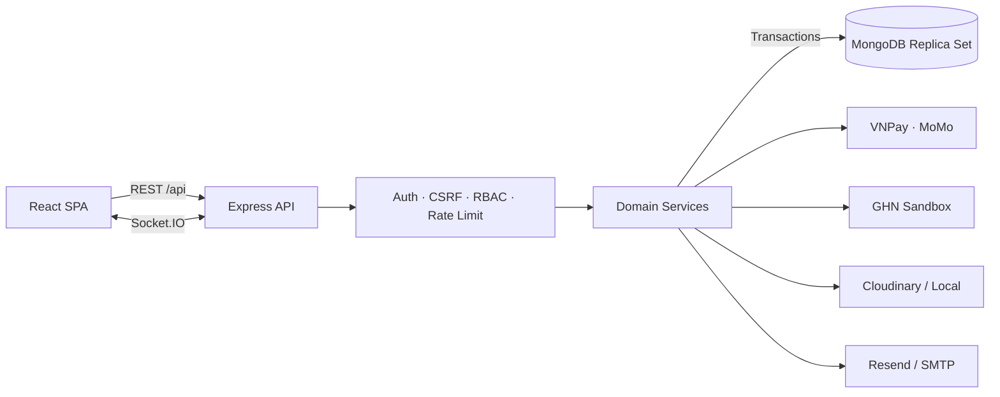
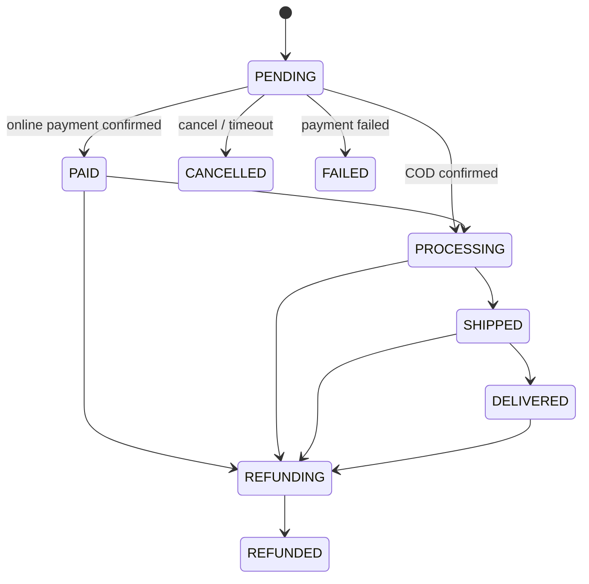

# BookShop — MERN Online Bookstore

BookShop là ứng dụng thương mại điện tử bán sách gồm storefront cho khách hàng và hệ thống quản trị theo quyền hạn cho nhân viên. Project triển khai trọn vẹn các bài toán backend quan trọng của e-commerce: xác thực phiên, checkout nhất quán, quản lý vòng đời đơn hàng, thanh toán/hoàn tiền, tồn kho có ledger, phân quyền và các tác vụ vận hành nền.

Đây là một portfolio project Backend/Full-stack. Nội dung bên dưới được tổng hợp trực tiếp từ source code hiện tại; project chưa có screenshot, video hoặc live demo công khai.

## Table of Contents

- [Engineering Highlights](#engineering-highlights)
- [Features](#features)
- [Tech Stack](#tech-stack)
- [Architecture](#architecture)
- [Core Business Flows](#core-business-flows)
- [API & Data Model](#api--data-model)
- [Roles & Permissions](#roles--permissions)
- [Run Locally](#run-locally)
- [Testing](#testing)
- [Deployment](#deployment)

## Engineering Highlights

- **Transactional checkout:** tạo order, giữ tồn kho, voucher và loyalty points được phối hợp trong MongoDB transaction. Backend bắt buộc MongoDB replica set/sharded cluster và fail-fast nếu database không hỗ trợ transaction.
- **Idempotent order/payment flow:** tạo đơn hỗ trợ `Idempotency-Key`; payment attempt có trạng thái riêng, giới hạn retry và xử lý callback đến muộn hoặc trùng lặp.
- **Explicit order state machine:** kiểm soát transition giữa `PENDING`, `PAID`, `PROCESSING`, `SHIPPED`, `DELIVERED`, `CANCELLED`, `FAILED`, `REFUNDING` và `REFUNDED`.
- **Payment recovery:** hỗ trợ COD, VNPay, MoMo và mock gateway ở development; callback/webhook được xác minh, refund được lưu trước khi gọi gateway và có job reconciliation cho trạng thái chưa kết thúc.
- **Inventory accounting:** phân biệt sellable stock và reserved stock; mọi biến động quan trọng đi qua `StockLedger`, phiếu nhập/xuất/kiểm kho, moving-average cost và optimistic guards để tránh ghi đè dữ liệu mới.
- **Secure session model:** access/refresh JWT trong HttpOnly cookie, refresh-token rotation, session revoke, CSRF double-submit, bcrypt, Helmet/CSP, CORS allowlist và rate limiting cho các endpoint nhạy cảm.
- **Database-backed RBAC:** role/permission lưu trong MongoDB, route guard kiểm tra quyền phía backend, cache registry và fail-closed khi không thể phân giải quyền.
- **Operational reliability:** health/readiness endpoint, audit log, order outbox, cleanup/reconciliation jobs và cron maintenance cho order, refund, inventory, shipping, support và reminders.
- **Testable design:** backend có unit/integration test với Node Test Runner, Supertest và `mongodb-memory-server`; frontend dùng Vitest, Testing Library và jsdom.

## Features

| Customer | Admin / Staff |
| --- | --- |
| Đăng ký, đăng nhập, refresh session, xác minh email và khôi phục mật khẩu | Dashboard, analytics, funnel và báo cáo lợi nhuận/đơn hàng |
| Tìm kiếm/lọc sách, giá promotion, recommendation và wishlist | Quản lý sách, danh mục, bài viết, review và newsletter |
| Guest cart, cart merge, buy-now và checkout từ giỏ hàng | Xử lý order state, payment audit, refund, return và GHN Sandbox shipment |
| Voucher, loyalty points/tier/gift và báo giá vận chuyển | Quản lý supplier, receipt, issue, stock count, ledger và low-stock |
| COD, VNPay, MoMo; retry payment và theo dõi order timeline | Quản lý voucher, promotion, loyalty program và member points |
| Verified-purchase review, return request, realtime notification | User administration, custom roles, permission matrix và audit log |
| Chat realtime, support ticket có SLA và newsletter double opt-in | Support queue, live chat, assignee, refund/reship resolution |

## Tech Stack

| Layer | Công nghệ |
| --- | --- |
| Frontend | React 18, Vite 6, React Router 7, Tailwind CSS, TanStack Query/Table, React Hook Form, Zod, Radix UI, Recharts |
| Backend | Node.js, Express 4, Mongoose 9, Socket.IO |
| Database | MongoDB 7 replica set |
| Security | JWT, bcryptjs, HttpOnly cookies, CSRF, Helmet/CSP, CORS, express-rate-limit |
| Integrations | VNPay, MoMo, GHN Sandbox, Cloudinary, Resend/SMTP |
| Testing & Ops | Node Test Runner, Supertest, mongodb-memory-server, Vitest, Testing Library; cấu hình triển khai Render |

## Architecture

Frontend React gọi REST API dưới `/api` và kết nối Socket.IO tới cùng backend. Express xử lý authentication, CSRF, rate limit và permission trước khi chuyển sang route/service. Domain services thực thi nghiệp vụ, dùng MongoDB transaction cho các thay đổi nhiều tài nguyên và tích hợp với payment, shipping, storage hoặc email provider.


```mermaid
flowchart LR
    Browser[React SPA] -->|REST /api| API[Express API]
    Browser <-->|Socket.IO| API
    API --> Guard[Auth · CSRF · RBAC · Rate Limit]
    Guard --> Services[Domain Services]
    Services -->|Transactions| Mongo[(MongoDB Replica Set)]
    Services --> Payment[VNPay · MoMo]
    Services --> Shipping[GHN Sandbox]
    Services --> Storage[Cloudinary / Local]
    Services --> Email[Resend / SMTP]
```

Source được tổ chức theo các phần chính:

```text
backend/src/
├── models/        # Mongoose schemas và state models
├── routes/        # REST endpoints + route guards
├── services/      # Order, payment, inventory, loyalty, support...
├── middleware/    # Authentication, RBAC, CSRF, error handling
├── jobs/          # Maintenance, reconciliation và backfill
└── config/        # Runtime config, database, permission catalog

frontend/src/
├── pages/         # Storefront, profile và admin screens
├── components/    # Shared/domain UI
├── services/      # REST client và Socket.IO
├── context/       # Auth, cart, category state
└── features/      # Feature-specific hooks, schema và constants
```

## Core Business Flows

### Authentication & Authorization

1. Register/login tạo `AuthSession`, access JWT, refresh JWT và CSRF token.
2. Access/refresh token được đặt trong HttpOnly cookie; unsafe request phải gửi `X-CSRF-Token` hợp lệ.
3. Frontend tự refresh phiên; backend rotate refresh token và có thể revoke một hoặc toàn bộ session.
4. Sau authentication, permission guard tra role registry trong MongoDB. Frontend permission gate chỉ phục vụ UX; backend mới là lớp kiểm soát bắt buộc.

### Checkout, Order & Payment

1. Client lấy shipping quote, chọn cart/buy-now, voucher, loyalty points và payment method.
2. Backend tải lại Book, giá promotion, tồn kho, voucher, điểm và cước vận chuyển; không tin giá từ client.
3. Transaction tạo Order, reserve inventory và ghi các movement liên quan. `Idempotency-Key` ngăn tạo trùng khi client retry.
4. COD chờ staff xác nhận; VNPay/MoMo tạo payment attempt và trả payment URL.
5. Callback/IPN/webhook hợp lệ cập nhật payment/order state; transition sẽ commit hoặc release inventory tương ứng.
6. Hủy đơn/return có thể đi vào refund workflow; maintenance job đối soát các refund/callback chưa kết thúc.


```mermaid
stateDiagram-v2
    [*] --> PENDING
    PENDING --> PAID: online payment confirmed
    PENDING --> PROCESSING: COD confirmed
    PENDING --> CANCELLED: cancel / timeout
    PENDING --> FAILED: payment failed
    PAID --> PROCESSING
    PROCESSING --> SHIPPED
    SHIPPED --> DELIVERED
    PAID --> REFUNDING
    PROCESSING --> REFUNDING
    SHIPPED --> REFUNDING
    DELIVERED --> REFUNDING
    REFUNDING --> REFUNDED
```

Sơ đồ trên chỉ thể hiện luồng chính; model còn có trạng thái trung gian `CANCELLING` và các transition phục hồi cho callback/refund bất đồng bộ.

### Inventory & Returns

- `Book.stock` là lượng còn bán được; `Book.reserved` là lượng đã giữ cho order nhưng còn vật lý trong kho.
- Phiếu nhập cập nhật stock và moving-average cost; phiếu xuất, fulfillment, cancellation và stock count đều tạo ledger entry.
- Stock count dùng giá trị snapshot/guard để từ chối dữ liệu cũ thay vì ghi đè một biến động vừa xảy ra.
- Review chỉ được tạo cho sách thuộc order đã `DELIVERED`. Return request hỗ trợ partial quantity, evidence, refund/reship và điều chỉnh lại inventory/loyalty.

## API & Data Model

API base URL khi chạy local: `http://localhost:5000/api`.

| Domain | Endpoint tiêu biểu |
| --- | --- |
| Auth | `POST /auth/register`, `POST /auth/login`, `POST /auth/refresh`, `POST /auth/reset-password` |
| Catalog & cart | `GET /books`, `GET /books/:id`, `GET /books/recommendations`, `/cart/*` |
| Order & payment | `POST /orders`, `POST /orders/:id/retry-payment`, `POST /orders/:id/cancel`, payment return/webhook routes |
| Shipping & returns | `POST /shipping/quotes`, `POST /orders/:id/return-request`, `/admin/orders/*` |
| Inventory | `/admin/inventory/*`, `/admin/stock-receipts/*`, `/admin/stock-issues/*`, `/admin/stock-counts/*` |
| Operations | `/admin/analytics/*`, `/admin/reports/*`, `/admin/audit-logs/*`, `GET /health/ready` |

Các model được chia theo domain thay vì một schema lớn:

- **Commerce:** `User`, `Book`, `Category`, `Cart`, `Order`, `ReturnRequest`, `Review`.
- **Payment & pricing:** payment data nằm trong Order; `Voucher`, `VoucherRedemption`, `Promotion`.
- **Inventory:** `Supplier`, `StockLedger`, `StockReceipt`, `StockIssue`, `StockCount`.
- **Security & governance:** `AuthSession`, `Role`, `AuditLog`.
- **Engagement:** loyalty models, `Notification`, `Conversation`, `Message`, `SupportTicket`, `Post`, `NewsletterSubscription`.
- **Operations:** `AnalyticsEvent`, `UploadedAsset`, `OrderOutboxEvent` và các delivery/reminder records.

Danh sách route đầy đủ nằm tại `backend/src/routes/`; Mongoose schemas nằm tại `backend/src/models/`.

## Roles & Permissions

| System role | Phạm vi chính |
| --- | --- |
| `user` | Tài khoản mua hàng, không có quyền quản trị |
| `admin` | Wildcard `*`, toàn quyền; role bị khóa |
| `warehouse` | Inventory, supplier, fulfillment và upload |
| `support` | Order support, ticket, chat, customer lookup; đọc loyalty/inventory |
| `content` | Book, category, post, newsletter và review moderation |
| `accounting` | Analytics, reports, payment audit, voucher, promotion và loyalty |

Admin có thể tạo role tùy chỉnh nhưng chỉ từ permission catalog trong source. Các quyền nhạy cảm như `inventory.adjust`, `loyalty.adjust`, `order.payment.audit`, `user.manage`, `role.manage` và `audit.read` được bảo vệ riêng.

## Run Locally

### Requirements

- Node.js + npm. Repository hiện chưa pin Node version bằng `engines` hoặc `.nvmrc`.
- MongoDB hỗ trợ transaction (replica set hoặc sharded cluster), cài trực tiếp hoặc dùng dịch vụ MongoDB bên ngoài.

### Setup

Chuẩn bị một MongoDB instance hỗ trợ transaction trước khi khởi động backend. Backend và frontend chạy bằng Node.js/npm.

```bash
git clone https://github.com/nkcuongdev/BookShop.git
cd BookShop

npm ci --prefix backend
npm ci --prefix frontend

cp frontend/.env.example frontend/.env
```

Tạo `backend/.env` với cấu hình local tối thiểu bên dưới. Ví dụ `MONGO_URI` dùng replica set local tên `rs0`; thay bằng connection string của MongoDB instance đã chuẩn bị nếu dùng cấu hình khác.

```env
PORT=5000
MONGO_URI=mongodb://localhost:27017/bookshop?replicaSet=rs0
JWT_SECRET=<random-secret-at-least-32-bytes>
JWT_REFRESH_SECRET=<different-random-secret-at-least-32-bytes>
FRONTEND_URL=http://localhost:5173
API_PUBLIC_URL=http://localhost:5000
PAYMENT_MOCK_ENABLED=true
```

Frontend:

```env
VITE_API_BASE_URL=http://localhost:5000/api
VITE_SITE_URL=http://localhost:5173
```

Cloudinary, Resend/SMTP, VNPay, MoMo, GHN Sandbox và các giới hạn nghiệp vụ đều đã có placeholder trong hai file `.env.example`. Không đưa secret vào biến `VITE_*`.

### Start development

```bash
# Terminal 1
npm run dev --prefix backend

# Terminal 2
npm run dev --prefix frontend
```

- Frontend: `http://localhost:5173`
- Backend: `http://localhost:5000`
- Readiness: `http://localhost:5000/api/health/ready`

Optional destructive demo seed: cấu hình `SEED_CONFIRM=RESET_BOOKSHOP_DATA` cùng các seed password trong `backend/.env`, sau đó chạy `npm run seed --prefix backend`.

## Testing

Backend test bao phủ auth/session, security headers, order/payment, inventory ledger, shipping, return/refund, loyalty, RBAC, analytics và support. Frontend test bao phủ context, API client, form/component và các race/hydration flow quan trọng.

```bash
# Backend
npm test --prefix backend
npm run test:unit --prefix backend

# Frontend
npm test --prefix frontend

# Static checks
npm run lint --prefix backend
npm run lint --prefix frontend
```

Watch mode: `npm run test:watch --prefix backend` hoặc `npm run test:watch --prefix frontend`.

## Deployment

`render.yaml` cung cấp cấu hình triển khai trên Render. Các thành phần ứng dụng chính gồm:

- Web service `bookshop-api` cài dependencies, build React và chạy Express.
- Express phục vụ `frontend/dist` trong production, nên SPA và API dùng chung origin.
- Health check dùng `/api/health/ready`.
- Cron `bookshop-maintenance` chạy mỗi 5 phút cho các tác vụ cleanup, timeout, reconciliation, alert và reminder.
- Shared environment group chứa cấu hình runtime; credential MongoDB, mail, storage, payment và GHN được khai báo `sync: false` hoặc inject từ service.

Trước khi triển khai, đối chiếu đầy đủ các biến môi trường trong `render.yaml` và các điều kiện khởi động tại `backend/src/config/index.js`. MongoDB phải hỗ trợ transaction; upload và email cần cấu hình provider hợp lệ. Payment/GHN cần credential tương ứng nếu bật tích hợp thật; source chỉ cho phép GHN Sandbox.
